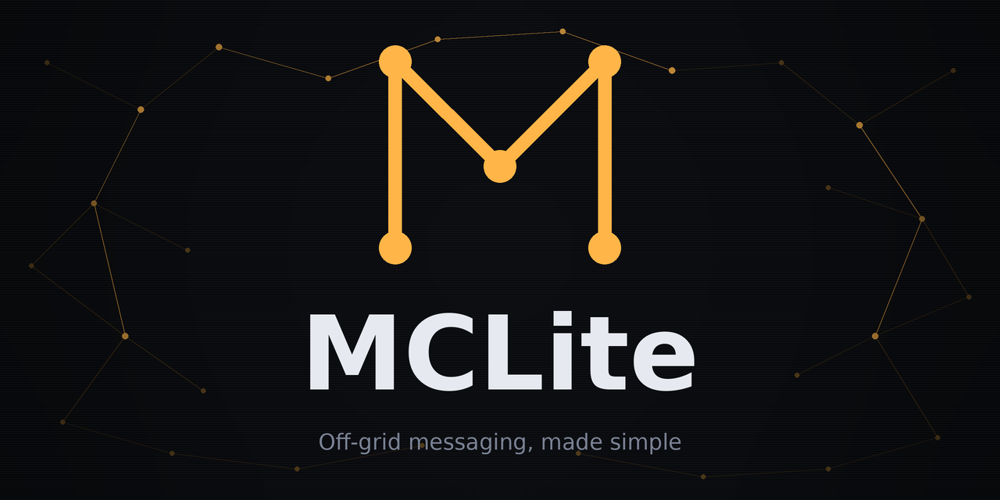
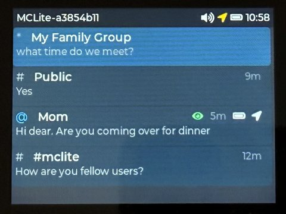
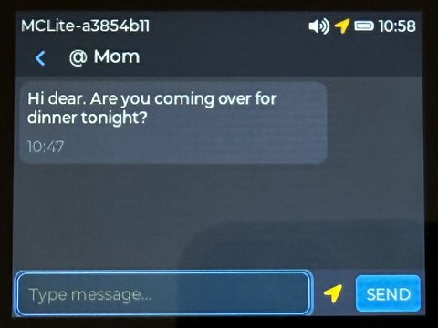

<p align="center">
  
</p>

# MCLite for T-Deck Plus

Lightweight off-grid communicator firmware for the LilyGo T-Deck Plus. Built on [MeshCore](https://github.com/ripplebiz/MeshCore), MCLite is purpose-built for emergency and outdoor communication -- no internet, no cell towers, no training needed. Turn it on and communicate.

MCLite is ideal for groups, families, search and rescue teams, and anyone who needs reliable off-grid messaging. It is fully compatible with other MeshCore devices and companion apps (iOS, Android) -- MCLite users can communicate with anyone on the same MeshCore network. All configuration is done in a single file -- one person sets it up, copies it to everyone's SD card, and the whole group is ready to go. No accounts, no pairing, no per-device setup. Perfect for kids, older family members, or anyone who just needs it to work.

Most features below are optional. The primary goal is to keep things extremely simple -- anyone who can use a smartphone can use MCLite without explanation. Advanced features like telemetry, GPS sharing, or PIN lock are there when you need them, but they stay out of the way until then.

<p align="center">
  <a href="https://laserir.github.io/MCLite/tools/web-flasher/"></a>
  &nbsp;
  <a href="https://laserir.github.io/MCLite/tools/config-tool/mclite_config_tool.html"></a>
</p>

<p align="center">
&nbsp;&nbsp;

</p>

## Features

- **Direct messages** -- private encrypted conversations between contacts
- **Channels** -- group communication via shared or public channels, with optional read-only (listen-only) mode
- **Room servers** -- join community message boards run by MeshCore room servers (up to 8). Posts arrive on the conversation list with an `R` icon, ordered alongside DMs and channels by last activity. Auto-login on boot with retry; re-login on chat-open and after 10 minutes of silence to recover from brief radio dropouts. Configured via `room_servers` in `config.json` (name, server public key, optional password)
- **Heard adverts** -- browse a rolling 64-entry list of every device your radio has decoded, reachable from the admin screen. Per-row type icon (chat / repeater / room / sensor), hops, last-heard age, GPS when present. Tap a chat advert for the full per-hop path + fingerprint and a one-tap **Save** that adds it to your contact list (queued, applies on next reboot). Manual-advert button announces yourself on demand without waiting for the next periodic cycle
- **SOS alerts** -- long-press the trackball (hold 6 seconds) to broadcast an emergency alert
- **Battery alerts** -- automatic low-battery warnings sent to your contacts
- **GPS location sharing** -- manually send your position in lat/lon or UTMREF/MGRS (military grid) format, used by search and rescue worldwide. Last-known position support when GPS signal is temporarily lost
- **Telemetry** -- responds to MeshCore-standard telemetry requests (battery, GPS) with per-contact permissions. Compatible with MeshCore companion apps. Optionally request telemetry from contacts to see their battery, location, and distance
- **Map view** -- visualise a contact's position on a slippy map (optional, requires tile pack on SD card). Zoomable, with own-device marker overlaid
- **Message history** -- conversations saved to SD card and restored on reboot
- **Quick replies** -- optional canned message picker for fast responses (OK, Copy, Need help, etc.), translatable and customizable
- **Multi-language** -- English, German, French, and Italian included. Add your own translations via SD card
- **Notification sounds** -- chime on incoming messages, alarm on SOS. Supports custom WAV files from SD card
- **Auto-dim** -- screen and keyboard backlight dim after inactivity to save battery
- **Multiple input methods** -- QWERTY keyboard, trackball, and touchscreen
- **Screen lock** -- hold the trackball for 1 second to lock. Key lock blocks all input and unlocks with another 1s hold. PIN lock requires a code to unlock. Optional auto-lock on display dim
- **Region scope** -- tag outgoing packets with MeshCore transport codes so repeaters can filter by region. Set a global scope or override per channel/room
- **Path hash mode** -- configurable repeater path fingerprint size (1/2/3 bytes per hop). Larger sizes reduce path collisions in dense meshes at the cost of a few extra bytes per hop. Defaults to 1 byte for compatibility with pre-v1.15 peers
- **Offgrid mode** -- one-flag toggle that switches to the community offgrid frequency (433/869/918 MHz, auto-picked from your normal frequency) and relays packets for other offgrid nodes. Camping / hiking / SAR scenarios where no repeaters exist. Toggle on-device from the admin screen or via config tool, reboot to apply. While offgrid, only other offgrid peers receive your messages, SOS, and battery alerts.
- **Zero-config for end users** -- all settings live in one JSON file on the SD card. Set it up once, copy to every device in your group

## Getting Started

### Install the firmware

**Option 1: Web Flasher (recommended)**

Visit the [MCLite Web Flasher](https://laserir.github.io/MCLite/tools/web-flasher/), select a version, and flash directly from your browser. No software to install -- just Chrome/Edge and a USB cable.

**Option 2: Manual**

Download the latest `mclite-v*.bin` from the [Releases](../../releases) page and flash with esptool: `esptool.py write_flash 0x0 mclite-v0.1.8.bin`

### Set up your config

**Option 1: Config Tool (recommended)**

1. Open the [MCLite Config Tool](https://laserir.github.io/MCLite/tools/config-tool/mclite_config_tool.html) in any web browser (or use the local file at `tools/config-tool/mclite_config_tool.html`). It works offline -- no internet needed, nothing to install.
2. The **Setup Wizard** opens automatically and walks you through the essentials: device name, region, key pair, and default channels. For more detailed settings (telemetry, GPS format, PIN lock, etc.), use the full editor after completing the wizard.
3. Click **Export** to download `mclite-config.zip` (includes config and language files)
4. Unzip and copy all contents to the root of your SD card
5. Insert the SD card and power on -- done

To set up a group: use **Fleet Mode** in the Setup Wizard. Add a device for each person in your group, generate keys for all, then export -- the tool creates a ZIP with a folder per device, each containing `config.json` and language files. Copy each folder's contents to the corresponding SD card and you're done.

**Option 2: Blank SD card (quick start)**

1. Insert a blank FAT32-formatted SD card (max 32 GB) and power on
2. MCLite auto-generates a unique identity and creates a default config with the Public and #mclite channels
3. The device is immediately functional -- you can send and receive on both channels
4. To add contacts, channels, or change settings (language, radio preset, etc.): open the Config Tool, click **Import** to load the auto-created `config.json` from your SD card, make your changes, click **Export**, and copy the updated file back to the SD card

<details>
<summary><strong>Example config.json</strong> (click to expand)</summary>

```jsonc
{
  // Language: "" = English (default), "de" = German, "fr" = French, "it" = Italian
  // Add your own: place <code>.json in /mclite/lang/ on the SD card
  "language": "",

  "device": {
    "name": "Alice"                    // Display name shown in status bar and to other devices
  },

  // Radio settings — all devices in your group MUST use the same values
  // Use the Config Tool's preset buttons to fill these automatically
  "radio": {
    "frequency": 869.618,              // MHz — EU/UK/CH: 869.618, US/Canada: 910.525
    "spreading_factor": 8,             // EU: 8, US: 7 — higher = more range, slower
    "bandwidth": 62.5,                 // kHz — 62.5 for both presets
    "tx_power": 22,                    // dBm (1-22) — transmission power
    "coding_rate": 8,                  // EU: 8, US: 5 — error correction level
    "scope": "*",                      // Region scope: "*" = no filtering, "#name" = hashtag region (e.g. "#europe")
    "path_hash_mode": 0                // 0 (default, 1B/hop), 1 (2B/hop), 2 (3B/hop). Larger = fewer collisions in dense meshes but more airtime per hop. Keep 0 for compatibility with pre-v1.15 peers.
  },

  // Your identity — generated by the Config Tool (do NOT share your private key)
  "identity": {
    "private_key": "...your private key (hex)...",
    "public_key": "...your public key (hex)..."
  },

  // Contacts — people you can send direct messages to
  "contacts": [
    {
      "alias": "Bob",                  // Display name
      "public_key": "...hex...",       // Their public key (from their config)
      "allow_telemetry": true,         // Base telemetry permission (must be true for location/environment to work)
      "allow_location": false,         // Let them request your GPS location (requires allow_telemetry)
      "allow_environment": false,      // Let them request environment sensor data (requires allow_telemetry)
      "always_sound": false,           // Play sound even when device is muted
      "allow_sos": true,               // Show SOS alerts from this contact
      "send_sos": true                 // Include in your outgoing SOS broadcast
    }
  ],

  // Channels — group communication
  "channels": [
    {
      "name": "Public",                // Well-known MeshCore public channel (all devices use this key)
      "type": "public",                // "public" = hardcoded PSK, "hashtag" = open, "private" = user-provided PSK
      "psk": "8b3387e9c5cdea6ac9e5edbaa115cd72",
      "index": 0,
      "allow_sos": false,               // Public channel: ignore SOS from strangers
      "send_sos": false,               // Public channel: SOS off by default (readable by everyone)
      "read_only": true                // Listen-only mode — hides the input bar
    },
    {
      "name": "#mclite",             // Hashtag channels: lowercase only (a-z, 0-9, -), shared by name
      "type": "hashtag",
      "index": 1,
      "allow_sos": true,
      "send_sos": false              // Hashtag default false — community channels shouldn't get SOS spam
    },
    {
      "name": "Team Alpha",
      "type": "private",               // Private channel — PSK shared out-of-band with group members
      "psk": "a1b2c3d4e5f6a7b8a1b2c3d4e5f6a7b8",
      "index": 2,
      "allow_sos": true,
      "send_sos": true,                // Private channel default true (trusted small group)
      "scope": "#local"                // Override global scope for this channel (omit or "" = inherit global)
    }
  ],

  // Room servers — community message boards run by MeshCore room servers (max 8)
  "room_servers": [
    {
      "name": "Ruhrgebiet",            // Display name shown in conversation list
      "public_key": "...64-hex...",    // Server's Ed25519 public key (shared out-of-band)
      "password": "secret",            // Up to 15 chars; "" = public room
      "allow_sos": true,               // Trigger SOS alert on posts starting with the SOS keyword
      "send_sos": false,               // Include this room in your outgoing SOS broadcast (default off — community rooms shouldn't be spammed)
      "read_only": false,              // Listen-only mode — hides the input bar
      "scope": ""                      // Per-room scope override (omit or "" = inherit global)
    }
  ],

  "display": {
    "brightness": 180,                 // 0-255
    "auto_dim_seconds": 30,            // Dim screen after N seconds of inactivity (0 = off)
    "dim_brightness": 0,               // Brightness when dimmed (0 = screen off, default)
    "boot_text": "",                   // Optional text shown on boot screen (e.g. team name)
    "kbd_backlight": true,             // Keyboard backlight on/off with auto-dim
    "kbd_brightness": 127              // Keyboard backlight brightness (1-255)
  },

  "messaging": {
    "save_history": true,              // Save messages to SD card
    "max_history_per_chat": 100,       // Max messages stored per conversation
    "location_format": "decimal",       // "decimal" = lat/lon, "mgrs" = UTMREF/MGRS, "both"
    "max_retries": 3,                  // DM delivery retry attempts (1-5)
    "request_telemetry": true,         // Tap contact name to see battery/location (optional)
    "show_telemetry": "both",          // Badges on convo list: "battery", "location", "both", "none"
    "canned_messages": true            // Quick-reply picker: true = on (default messages, default), false = off,
                                       //   or ["Reply 1", "Reply 2"] = on with custom messages (max 8)
  },

  "sound": {
    "enabled": true,                   // Master sound toggle
    "sos_keyword": "SOS",              // Keyword that triggers SOS alert sound
    "sos_repeat": 3                    // How many times to repeat SOS alarm (1-10)
  },

  "gps": {
    "enabled": true,
    "timezone": "",                    // POSIX TZ string for automatic DST (e.g. "CET-1CEST,M3.5.0/2,M10.5.0/3")
    "clock_offset": 0,                 // UTC offset in hours, no DST (-12 to +14). Ignored if timezone is set
    "last_known_max_age": 1800         // Seconds before last-known GPS position expires (60-7200)
  },

  "battery": {
    "low_alert_enabled": true,         // Send automatic low-battery alert to contacts
    "low_alert_threshold": 15          // Battery % that triggers the alert (5-50)
  },

  "security": {
    "lock": "key",                     // "none" = no lock, "key" = key lock (1s hold), "pin" = PIN lock
    "pin_code": "",                    // PIN code (4-8 alphanumeric characters, only for "pin" mode)
    "auto_lock": "key",                // Lock on display dim: "none", "key", "pin" (falls back if unavailable)
    "admin_enabled": true              // Allow access to device info screen (press 0)
  }
}
```

You don't need to write this by hand -- use the Config Tool. This example shows all available options with their defaults.

</details>

### Map tiles (optional)

If you want a visual map view when tapping a contact's name in chat (Telemetry → **Map**), copy slippy map tiles to `/tiles/` on the SD card root:

```
/tiles/<zoom>/<x>/<y>.png    (256×256 PNG, Web Mercator / EPSG:3857)
```

This is the same layout used by MeshCore's official T-Deck firmware, so any existing tile pack works unchanged. Zoom levels are auto-detected from the folder names present.

**Getting tiles**: [map-tiles-downloader](https://github.com/tekk/map-tiles-downloader) is a terminal tool (TUI) that produces exactly this layout -- pick a country/region, zoom range, tile source, and export.

Region codes in that tool are GeoNames admin1 codes, not the local administrative numbers you may be familiar with. For Germany, a few common ones: `02` = Bayern, `04` = Hamburg, `07` = Nordrhein-Westfalen, `16` = Berlin. Check the [GeoNames admin1 codes list](https://download.geonames.org/export/dump/admin1CodesASCII.txt) for other countries.

## Hints

**Shortcuts**

| Action | How |
|--------|-----|
| Device info | Sym + 0 |
| Mute / unmute | Tap speaker icon in status bar |
| Contact telemetry | Tap contact name in chat header |
| Retry failed message | Tap the X on a failed message |
| Quick reply | Tap the list icon (≡) left of the text input |
| Lock / unlock | Hold trackball for 1 second |
| SOS broadcast | Hold trackball for 6 seconds |

**Conversation list icons**

| Symbol | Meaning |
|--------|---------|
| @ | Direct message (contact) |
| # | Public or hashtag channel |
| * | Private channel |
| R | Room server (purple) |
| Green eye | Contact recently seen on the mesh |
| Green dot | Unread messages |
| Battery / GPS | Contact's last reported telemetry |

**Status bar**

| Icon | Meaning |
|------|---------|
| GPS | Green = live fix, amber = last known, gray = no fix |
| Battery | Charge level; charging symbol when plugged in |

**Message delivery indicators**

| Icon | Meaning |
|------|---------|
| Single check | Message sent, waiting for acknowledgement |
| Double check | Message delivered (acknowledged by recipient) |
| X | Delivery failed -- tap to retry |

**SOS keyword** -- incoming messages containing "SOS" (default) trigger an alert sound. The same keyword is sent via the trackball long-press SOS. Best left unchanged so all devices recognize each other's alerts.

## Radio Compatibility

MCLite uses MeshCore for radio communication and is compatible with other MeshCore devices. Built-in radio presets:

- **EU/UK/CH**: 869.618 MHz, SF8, BW62.5, CR8, 22 dBm
- **US/Canada**: 910.525 MHz, SF7, BW62.5, CR5, 22 dBm
- **Australia Wide**: 915.800 MHz, SF10, BW250, CR5, 22 dBm
- **Australia Victoria**: 916.575 MHz, SF10, BW250, CR5, 22 dBm

All devices in your group must use the same radio settings. Compatible with both 1-byte and 2-byte repeaters.

### Regulatory Compliance

**EU/UK/CH (868 MHz)**: MCLite enforces the ETSI EN 300 220 duty cycle limit for the G3 sub-band (869.40–869.65 MHz). TX duty cycle is capped at 10% through MeshCore's airtime budget mechanism. The Admin screen shows real-time channel utilization so you can verify compliance.

**US/Canada (915 MHz)**: The US ISM band (902–928 MHz) has no duty cycle restriction under FCC Part 15.247. MCLite uses the MeshCore default airtime budget (33%).

**Australia (915 MHz)**: The 915–928 MHz ISM band is available under ACMA class licence (LIPD-2015). MCLite uses the MeshCore default airtime budget (33%).

> **Disclaimer**: MCLite is experimental open-source software, not a certified radio product. The firmware-level duty cycle cap is provided as a best-effort aid, not a guarantee of regulatory compliance. The operator is solely responsible for ensuring that their complete setup (firmware, hardware, antenna, configuration) complies with all applicable local laws and regulations. The authors accept no liability for non-compliance or any consequences arising from the use of this software.

## License

MCLite firmware is released under the **MIT License**. See [LICENSE](LICENSE) for details.

MCLite uses the following open-source libraries:

| Library | License |
|---------|---------|
| MeshCore | MIT |
| LVGL | MIT |
| LovyanGFX | MIT + BSD-2-Clause |
| ArduinoJson | MIT |
| RadioLib | MIT |
| TinyGPSPlus | LGPL-2.1 |
| Arduino ESP32 core | LGPL-2.1 |

LGPL-2.1 libraries are dynamically linked. Users may replace them by rebuilding with PlatformIO. See [LICENSES.md](LICENSES.md) for full copyright notices.

## Contributing

Contributions are welcome. Please open an issue or pull request on GitHub.

## Embed on your site

Help spread MCLite by linking to it from your own page. Drop one of these snippets into any HTML — the buttons render identically across light and dark themes and require no external CSS or fonts.

<p align="center">
  <a href="https://laserir.github.io/MCLite/tools/web-flasher/"></a>
  &nbsp;
  <a href="https://laserir.github.io/MCLite/tools/config-tool/mclite_config_tool.html"></a>
  &nbsp;
  <a href="https://laserir.github.io/MCLite/tools/config-tool/mclite_config_tool.html#preset="></a>
  &nbsp;
  <a href="https://github.com/laserir/MCLite"></a>
</p>

```html
<!-- Flash button -->
<a href="https://laserir.github.io/MCLite/tools/web-flasher/">
  
</a>

<!-- Config tool button -->
<a href="https://laserir.github.io/MCLite/tools/config-tool/mclite_config_tool.html">
  
</a>

<!-- GitHub button -->
<a href="https://github.com/laserir/MCLite">
  
</a>
```

### Pre-filled preset links for local groups

Running a regional MCLite group? You can publish a **preset link** that opens the config tool with your channels, radio settings, contacts, boot text, and more already filled in — visitors only need to add their own identity before exporting.

1. Open the [Config Tool](https://laserir.github.io/MCLite/tools/config-tool/mclite_config_tool.html) and configure the settings you want to share.
2. Choose **Share preset link…** from the ⋯ menu (top-right).
3. Tick the sidebar sections to include — `Device` (name, identity keys) and `Security` (PIN, lock mode) are always excluded.
4. Copy the generated URL and embed it on your site, just like the Config Tool button:

```html
<!-- Pre-filled config link (replace the # fragment with your generated preset) -->
<a href="https://laserir.github.io/MCLite/tools/config-tool/mclite_config_tool.html#preset=YOUR_BASE64_PAYLOAD">
  
</a>
```

The preset is encoded entirely in the URL fragment (`#preset=…`), so it's never sent to a server. Opening the link generates a fresh keypair and overlays your shared settings on top — the visitor reviews them in the **Preset applied** banner before exporting.
